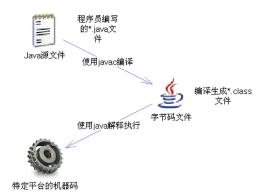

## 介绍一些基础的概念

- 什么是软件？  
软件就是按特定顺序执行的计算机数据和指令的集合。

- 软件种类：  
系统软件： DOS(Disk Operation System), Windows, Linux  
应用软件： 如百度云，腾讯视频，微信，王者荣耀等等  

- 什么是软件开发？  
制作软件的过程就叫做软件开发。  

- 人和计算机交互的方式：  
图形化界面（Graphical User Interface: GUI）: 简单易上手，通过鼠标点击进行操作。  
命令行界面(Command Line Interface: CLI): 打开 cmd 用命令控制台进行操作。 需要记住各种命令， 如果不记得，
可以用 help 命令来查询。  

- 计算机语言  
当通过 command line 操作计算机时，其实就像在和计算机说话，你输入的命令就是你对计算机说的话。但是需要注意的是，
计算机只能识别特定的内容。  
我们知道**语言**是人与人之间进行沟通的方式，那么相应的，**计算机语言就是人与计算机之间进行交流的方式**。如果
人想和计算机交流，就要学习计算机语言，如：C, C++, Java 等。  

## Java 语言概述  
Java 是 SUN(Stanford University Network, 斯坦福大学网络公司) 公司在1995年推出的一门高级编程语言。  
Java 之父 -- JamesGosling（詹姆斯·高斯林）  

**一些题外话：** SUN 公司在2009年已被 Oracle 公司收购，收购之后 Oracle 公司的架构发生了很大变化，下面是 Oracle
和 Microsoft 公司的对比：   

|体系结构               |Oracle                  |Microsoft
|----                   |----                    |---
|操作系统               |UNIX                     |Windows （server）
|数据库                 |Oracle大型数据库         |SQL server中小型数据库
|中间件                 |OAS，收购BEA得WebLogic    |IIS
|编程语言               |PLSQL，收购SUN得到JAVA    |.NET

### Java 语言的三种技术架构  
- **J2SE(Java 2Platform Standard Edition):** 标准版，开发普通的应用程序，比较基础，是另外两种体系的基础。  
- **J2EE(Java 2Platform Enterprise Edition):** 为开发企业环境下的应用程序提供的一套解决方案，该体系中包含的
技术如 Servlet, JSP 等，主要针对Web应用程序开发。  
- **J2ME(Java 2Platform Micro Edition):** 小型版，开发电子消费产品和嵌入式设备。主要针对于小型电子消费产品，如手机
中的应用程序等。（现在已经不适用了，因为手机都有了自己的操作系统）  
Java5.0之后，更名为 **JAVAEE, JAVASE, JAVAME**  

### Java程序的运行机制  
Java语言是一种计算机高级语言。计算机高级语言按照程序的执行方式分为**编译型语言**和**解释型语言**。  
- 编译型语言是指使用专门的编译器，针对平台（操作系统）将源代码一次性编译成平台可以直接识别并执行的机器码。  
编译生成的可执行性程序可以脱离开发环境在特定平台上独立运行。我们所知的C, C++, Objective-C, Swift, Kotlin等语言都是编译型语言。  
- 解释型语言是指使用专门的解释器，针对平台<mark>逐行解释代码并立即执行</mark>的过程。解释型语言通常不会进行整体性的编译和链接处理。
它相当于把编译型语言中的编译和解释过程混合在一起。  
可以认为，每次执行解释型语言的程序都需要进行一次编译，比如，一段有好多行的解释型语言的代码，逐行执行就意味着每一行都需要单独的
编译。因此解释型语言的程序运行效率比减低。Javascript, Python及Ruby都属于解释型语言。  

而Java语言比较特殊，必须进行先编译后解释的过程。Java源代码首先经由编译器编译生成与平台无关的字节码（.class文件）。但是
这个文件不能直接被平台执行，而要经过特定的Java解释器来解释执行。  
所以Java语言既是编译型语言又是解释型语言，或者说它既不是单纯的编译型语言，也不是单纯的解释型语言。  
  

大家都说用java语言编写的应用程序在不同的系统平台上都能运行，也就是Java可以跨平台。那么这是为什么？背后的原理是什么？   
<mark>Java应用程序是指编译Java后得到的字节码文件打包后的应用程序，而不是Java源代码。</mark>  
要运行Java应用程序就要有Java解释器，那么Windows 系统和 Linux 系统都没有 java 语言的解释器，它们如何运行 java 编写的应用程序呢？  
SUN 公司开发的 JVM 就是这个目的。<mark>JVM(Java Virtual Machine, java虚拟机)是一个能解释并执行 java应用程序的应用软件。</mark>    
所以 java语言的跨平台性是有前提的，所有的操作系统如果想执行java应用程序，必须先安装该应用系统对应的JVM。  

- Java 语言的环境搭建  
前面我们知道了，java应用程序必须通过JVM来解释和执行，所以在运行java应用程序之前，我们必须先安装JVM。但是实际上我们不会直接安装JVM，
而是会先在操作系统上安装JDK并搭建好所需的环境。不仅是java，任何一种开发语言都需要特定的环境来运行，所以在写代码之前都要先搭建环境。  

  首先来了解几个概念：  
  **JRE(Java Runtime Environment, java运行环境)**： 它包括 JVM 和运行Java程序的其他环境支持，如类加载器、字节码文件
  校验器和大量的基础类库。如果想运行一个别人开发好的java应用程序，计算机中只需要安装JRE即可。  
  但是如果不仅需要运行应用程序，还要开发应用程序，那么只有 JRE 就不够了，还需要JDK。  
  
  **JDK(Java SE Development Kit, java标准开发程序包)**： 它包括java的开发工具（如编译工具javac.exe 和打包工具jar.exe等），
  也包括 JRE。所以安装了JDK后就不用单独安装JRE了。  
  JDK为什么会包括JRE呢？ 第一，开发完程序后，总要运行一下看看效果。第二，也是最重要的是，JDK中的开发工具本质上也是
  java应用程序，为了方便使用才把这些工具打包成exe文件。所以为了使用这些工具，也需要JRE的支持。
  >JRE = JVM + Java运行环境支持  
  JDK = JRE + Java开发工具

  Java 安装和配置：  
  去 Oracle 官网下载 jdk 安装包，然后进行安装。 安装后会得到一个 jdk 文件夹，该文件夹下有许多别的文件夹，如：
  bin, jre, lib 等等。  
  **bin:** 这个文件夹里是一些 .exe 文件，这些文件都是java应用程序，只是被打包成了 .exe 文件。当你双击文件时，
  这些程序会被执行，这也算是一种人机交互，但是看到的是一个页面一闪而过，说明是用命令行方式执行。  
  
  正常情况下，我们需要通过命令行控制台来执行命令，所以cmd打开控制台，然后输入 javac，会得到 javac 不是命令的报错
  信息，这是为什么呢？  
  首先检查，你是在哪个目录下运行的命令，必须要用 cd 命令行，到你安装了 jdk的文件夹下面的的 bin 文件夹下，再执行命令。  
  
  但是如果每次要运行程序，都要到安装 jdk 的目录下是很麻烦的，有没有一种方式可以直接在 cmd 控制台中的任何目录下都
  能直接运行程序呢？  
  答案是有的。那就是配置环境变量。  
  > 通常情况下，windows系统首先在当前目录下寻找你输入的命令，如果找不到就会去你配置的环境变量中系统变量的Path
  中去找。 Path这个变量中存储的是一些应用程序的路径，只要是Path中的路径，这些路径下的可执行程序(.exe/.bat/等)都会被识别。   
  扩展内容：CLASSPATH 中配置的是一些class文件的路径。 当运行程序时，如果配置了CLASSPATH，JVM默认从这里找执行文件。
 
- Java 开发初体验  
（1）将java代码编写到扩展名为 .java 的文件中，这就是你编写的源文件，源文件并不能被计算机识别。  
（2）使用JDK中的开发工具，也就是 javac.exe 应用程序对java源文件进行编译，生成扩展名为.class的二进制文件，这样才能被计算机识别。  
（3）要运行.class文件必须使用JVM，使用java.exe 应用程序就能启动JVM对 .class 文件进行运行  
扩展知识：  
编译时只会检测源代码中的语法错误。    

 
  
    

 

